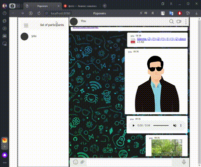
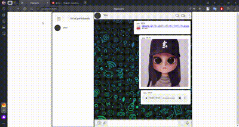
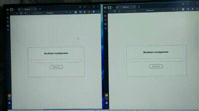
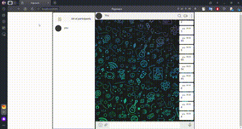

## Реализованные функции

### Обязательные для реализации функции (5/5)

* Сохранение в истории ссылок и текстовых сообщений

* Ссылки (то, что начинается с `http://` или `https://`) должны быть кликабельны и отображаться как ссылки

---

* Сохранение в истории изображений, видео и аудио (как файлов), с отображением превью файла - через Drag & Drop и через иконку загрузки (скрепка в большинстве мессенджеров). 
* Скачивание файлов (на компьютер пользователя)

Может не так хоро получилось показать Drag & Drop

---

* Скачивание файлов (на компьютер пользователя)

  
---
* Ленивая подгрузка: сначала подгружаются последние 10 сообщений, при прокрутке вверх подгружаются следующие 10 и т.д.

---
### Дополнительные для реализации функции:
* Cинхронизация: если приложение открыто в нескольких окнах или вкладках, то контент должен быть синхронизирован

---
* Запись видео и аудио, используя API браузера;
* Воспроизведение видео/аудио, используя API браузера;
---
ЕЩЕ СДЕЛАЛА СКАЧИВАНИЕ АУДИО И ВИДЕО

---
* Отправка геолокации.

---
* Установка напоминаний и напоминания через Notification API: @schedule: 18:04 31.08.2019 «Последний день лета»
  Срабатывает через 1 мин.

---
* поддержка смайликов (emoji)
  
  ---
* поддержка оформления кода:
  
  
  Еще сделала вход
    

  

  